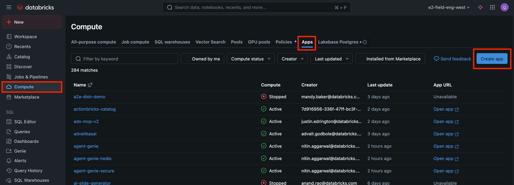
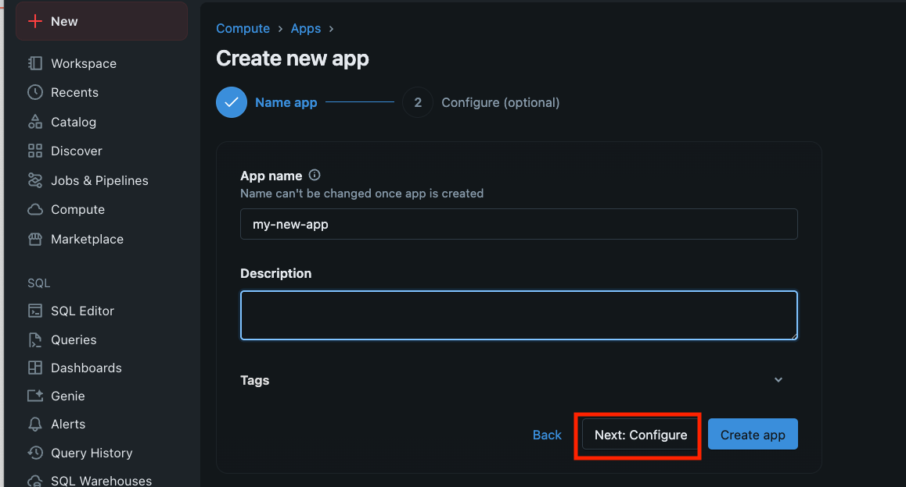
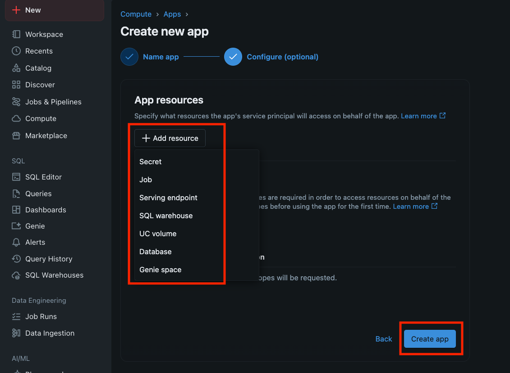
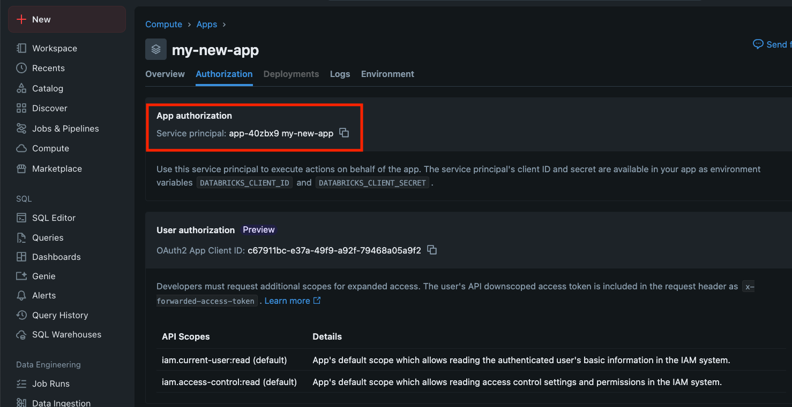

# Databricks Full Stack App - Document Redaction Demo

A full-stack application demonstrating AI Functions for document redaction, built for deployment on Databricks Apps.

## Features

- **Document Upload**: Upload PDFs to Unity Catalog volumes
- **AI-Powered Parsing**: Extract tables from documents using Databricks AI Functions: `ai_parse_document()`
- **Data Storage**: Store processed data in Delta tables
- **PDF Redaction**: Perform name entity redaction using AI_function
- **PDF Export**: Generate Excel files from extracted table data

## Architecture

- **Frontend**: Next.js with TypeScript and TailwindCSS
- **Backend**: FastAPI with Databricks SDK integration
- **Storage**: Unity Catalog volumes and Delta tables
- **AI Functions**: 
    - Document parsing and table extraction with `ai_parse_document`
    - Document name entity discovery and `ai_query`

## Quick Start

### Local Development

1. **Backend**:
```bash
cd backend
pip install -r requirements.txt
uvicorn app:app --reload
```

2. **Frontend**:
```bash
cd frontend
npm install
npm run dev
```

### Deployment to Databricks

Step 1: Create an empty app with the Databricks app



Step 2: Config the app name and resources






Step 3: Grant the app service principle the right permission

e.g. Unity Catalog Schema, Volumes




Step 4: Modify `deploy.sh` based on your setup or pass them as argument

- Modify `APP_FOLDER_IN_WOKRSPACE` and `LAKEHOUSE_APP_NAME` in `deploy.sh` then run

```bash
./deploy.sh
```
or

- run with argument
```bash
./deploy.sh [APP_FOLDER_IN_WOKRSPACE] [LAKEHOUSE_APP_NAME]
```

Alternative, one can always deploy manually by point the app to a databricks workspace folder where the app code is located

For more databricks app related document, please refer to [Reference](#reference)

## Configuration

Configure your environment in `backend/app.yaml`:
- `DATABRICKS_WAREHOUSE_ID`: SQL warehouse for AI Functions
- `DATABRICKS_VOLUME_PATH`: Unity Catalog volume default path
- `DATABRICKS_DELTA_TABLE_PATH`: Default target Delta table

User can update these default setting using the app setting


## Requirements

- Databricks workspace with AI Functions enabled
- Unity Catalog with appropriate permissions
- SQL warehouse for AI Functions execution

## Reference

- [Databricks App Docs](https://learn.microsoft.com/en-us/azure/databricks/dev-tools/databricks-apps/)
- [Databricks App Cookbook](https://apps-cookbook.dev/)
- [FastAPI Docs](https://fastapi.tiangolo.com/tutorial/)
- [Next.js Docs](https://nextjs.org/docs)